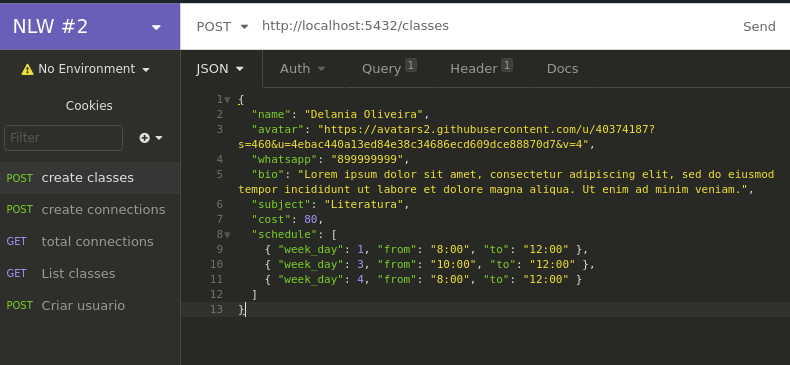

<p align="center"></p>

<h1 align="center"> Semana Next Level Week #2 - Proffy </h1>

<div align="center">
     
 </div>

-----
# :rocket: Info

Backend do projeto Proffy, uma plataforma de estudos online feito na semana Next Level Week #2 e realizado pela Rocketseat com o objetivo de conectar alunos à professores. 

# :rainbow: Deploy 

[https://nlw-proffy-jet.vercel.app/](https://nlw-proffy-jet.vercel.app/)


# :computer: Tecnologias

- TypeScript
- PostgreSQL
- NodeJS

# :wrench: Como instalar
### :bangbang: Requisitos
- NodeJS
- Yarn ou NPM
- Docker Desktop
- Insomnia
- Cliente de banco de dados compativel com PostgreSQL

1. clone o repositorio 
```bash
$ git clone https://github.com/sihann/nlw-proffy-backend
```
2. Entre na pasta do projeto
```bash
$ cd nlw-proffy-backend
```
3. Instale as dependências
```bash
$ yarn 
#ou
$ npm install
```
4. Crie um arquivo .env 
```bash
$ echo "PG_HOST=localhost PG_USER=postgres PG_PASSWORD=docker PG_DATABASE=proffy" > .env
```
5. Inicie uma instância de banco de dados na sua máquina
```bash
$ docker run --name nlw -e POSTGRES_PASSWORD=docker -p 5432:5432 -d postgres
```
6. Com o cliente de bancos de dados compatível com PostgreSQL, acesse o banco de dados usando as informações a seguir:
    - Endereço: localhost
    - Porta: 5432
    - Usuário: postgres
    - Senha: docker

7. Crie um banco de dados 
```SQL
 CREATE DATABASE nome-de-sua-escolha;
```
8. Crie as tabelas
```bash
$ yarn knex:migrate
#ou
$ npm run knex:migrate
```
9. Execute a aplicação
```bash
$ yarn dev
#ou
$ npm dev
```
10. Abra o Insomnia e execute a rota de criação de classes
[http://localhost:5432/classes](http://localhost:5432/classes)

<p align="center"></p>

## Para testar junto ao [frontend](https://github.com/sihann/nlw-Proffy)
1. Abra o arquivo _src/sevices/api.ts_ e mude o endereço da _baseURL_ 
```typeScript
baseURL: 'https://nlw-proffy-backend.herokuapp.com/'
# para
baseURL: 'https://localhost:5432/'
```
2. Execute a aplicação
```bash
$ yarn start
#ou
$ npm start
```

# :page_facing_up: Licença


-----
<p align="center">Feito com  :purple_heart: por Delania Oliveira.  :wave:</p>

